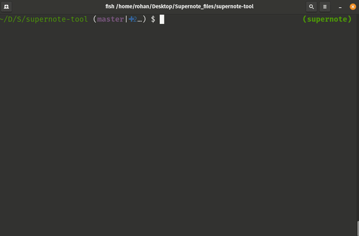

# Supernote local sync app

<p align="center">
    
</p>

## Install

Due to the library spec of [textual](https://github.com/willmcgugan/textual), this currently works on Macos/linux **only**.

```bash
# clone the repo, including submodules (ssh url example)
git clone --recurse-submodules git@github.com:RohanGautam/supernote-tool.git

# create a python environment (one-time)
conda create --name supernote python=3.7
conda activate supernote
# install dependencies
pip install -r requirements.txt
# Make a copy of the config template
cp config-template.env config.env
# MODIFY `config.env` with paths to your supernote and local sync directory!!
#-----
# Run the main file
python supernote-app.py
```

## Todo
- [ ] remove git submodule and use the new supernote pip library install instead.

## References

- u/fbalobanov on reddit, in [this post](https://www.reddit.com/r/Supernote/comments/qrxngb/python_script_for_desktop_note_files_viewer/) for the inspiration.
